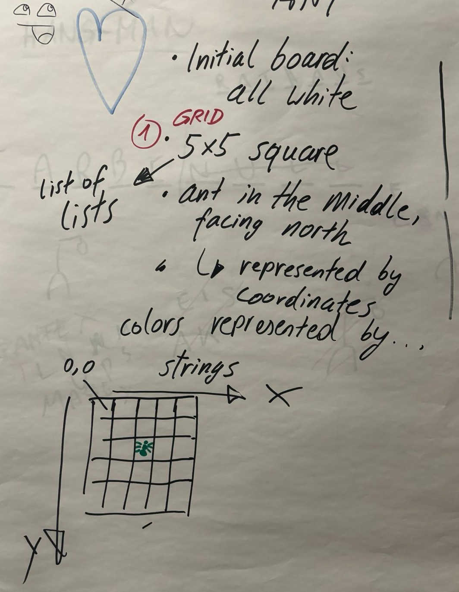

#  Langston's Ant ⬜🐜⬛

https://en.wikipedia.org/wiki/Langton%27s_ant

## Rules

Squares on a plane are colored variously either black or white. We arbitrarily
identify one square as the "ant". The ant can travel in any of the four
cardinal directions at each step it takes. The "ant" moves according to the
rules below:

* At a white square, turn 90° clockwise, flip the color of the square,
  move forward one unit
* At a black square, turn 90° counter-clockwise, flip the color of the square,
  move forward one unit

## Initial Discussion



## Run test

```console
ptw .
```

## Extension

The colors are modified in a cyclic fashion.
A simple naming scheme is used: for each of the successive colors,
a letter "L" or "R" is used to indicate whether a left or right turn
should be taken.

Langton's ant has the name "RL" in this naming scheme.

Some of these extended Langton's ants produce patterns that become
symmetric over and over again. One of the simplest examples is the ant "RLLR".
